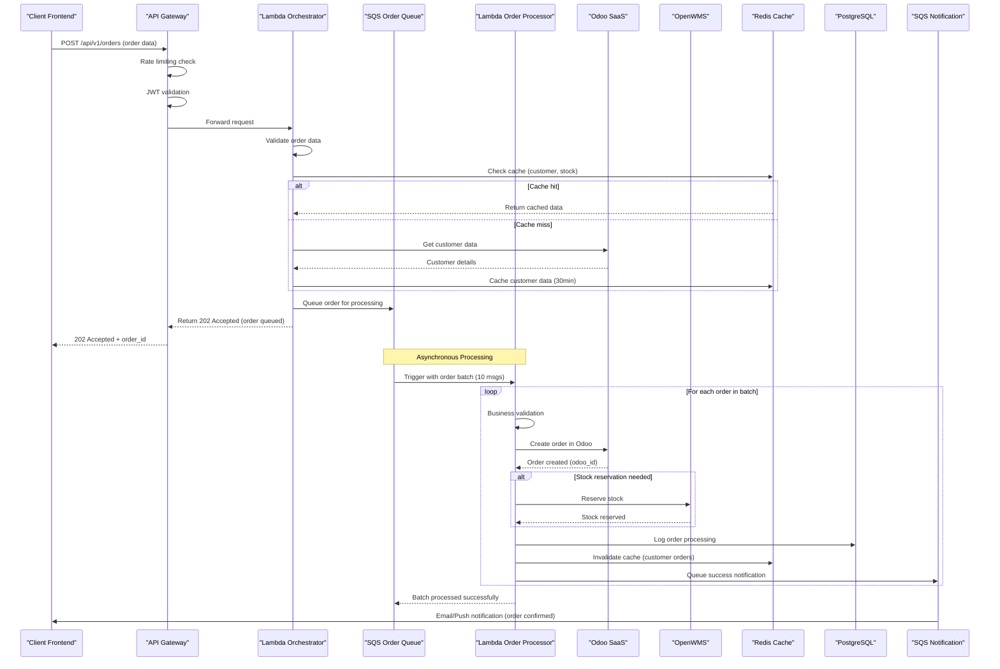
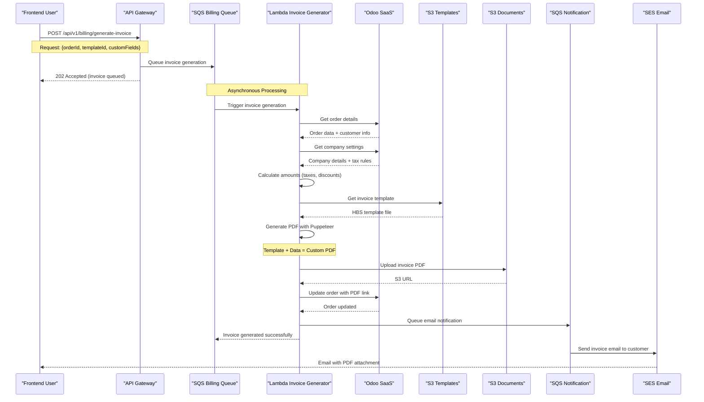
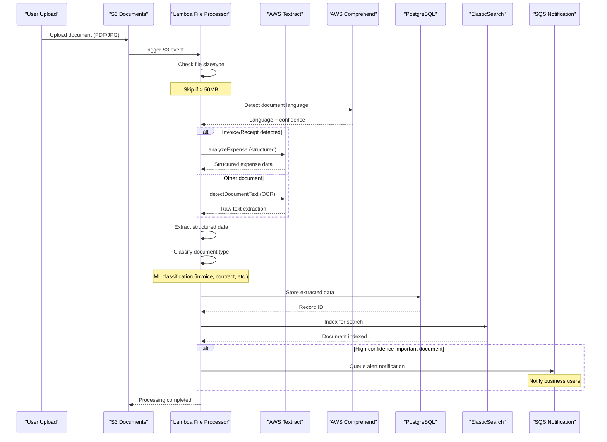
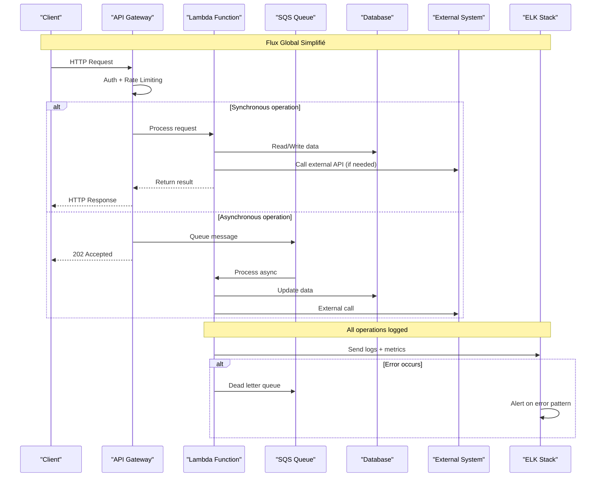

# 🏗️ **ARCHITECTURE STOCKOSS - VISION TECHNIQUE**
## Diagrammes et Flux de Données Détaillés

> **Focus** : Compréhension visuelle de l'architecture serverless scalable pour 1M commandes/an

---

## 🌐 **SCHÉMA GLOBAL D'ARCHITECTURE**

```
                                    INTERNET
                                       │
                               ┌───────────────┐
                               │   CLOUDFRONT  │
                               │   + Route 53  │
                               └───────┬───────┘
                                       │
                        ┌──────────────┼──────────────┐
                        │              │              │
                ┌───────▼──────┐      │      ┌───────▼──────┐
                │   FRONTEND   │      │      │  API GATEWAY │
                │   (S3 + CF)  │      │      │   (Managed)  │
                │              │      │      │              │
                │ ┌──────────┐ │      │      │ ┌──────────┐ │
                │ │ Next.js  │ │◄─────┼──────┤ │Rate Limit│ │
                │ │   PWA    │ │      │      │ │Auth/Cache│ │
                │ │Dashboard │ │      │      │ │Transform │ │
                │ └──────────┘ │      │      │ └──────────┘ │
                └──────────────┘      │      └───────┬──────┘
                                      │              │
                                      │      ┌───────▼──────┐
                                      │      │    LAMBDA    │
                                      │      │ ORCHESTRATOR │
                                      │      │              │
                                      │      │ ┌──────────┐ │
                                      │      │ │ Router   │ │
                                      │      │ │ Validate │ │
                                      │      │ │Transform │ │
                                      │      │ └──────────┘ │
                                      │      └───────┬──────┘
                                      │              │
                       ┌──────────────┼──────────────┼──────────────┐
                       │              │              │              │
               ┌───────▼──────┐ ┌─────▼─────┐ ┌─────▼─────┐ ┌─────▼─────┐
               │     SQS      │ │    SQS    │ │    SQS    │ │    SQS    │
               │    ORDER     │ │  BILLING  │ │NOTIFICATION│ │   FILE    │
               │    QUEUE     │ │   QUEUE   │ │   QUEUE   │ │  QUEUE    │
               └───────┬──────┘ └─────┬─────┘ └─────┬─────┘ └─────┬─────┘
                       │              │             │             │
               ┌───────▼──────┐ ┌─────▼─────┐ ┌─────▼─────┐ ┌─────▼─────┐
               │   LAMBDA     │ │  LAMBDA   │ │  LAMBDA   │ │  LAMBDA   │
               │    ORDER     │ │  INVOICE  │ │NOTIFICATION│ │   FILE    │
               │  PROCESSOR   │ │ GENERATOR │ │  HANDLER  │ │ PROCESSOR │
               └───────┬──────┘ └─────┬─────┘ └─────┬─────┘ └─────┬─────┘
                       │              │             │             │
                       └──────┬───────┼─────────────┼─────────────┼───┐
                              │       │             │             │   │
                              ▼       ▼             ▼             ▼   ▼
                       ┌─────────────────────────────────────────────────┐
                       │                DATA LAYER                       │
                       │                                                 │
                       │ ┌───────────┐ ┌─────────┐ ┌─────────┐ ┌──────┐ │
                       │ │    RDS    │ │  REDIS  │ │DYNAMODB │ │  S3  │ │
                       │ │PostgreSQL │ │ CLUSTER │ │HOT DATA │ │DOCS  │ │
                       │ │ r5.large  │ │3 NODES  │ │SESSIONS │ │FILES │ │
                       │ │ Multi-AZ  │ │FAILOVER │ │COUNTERS │ │TEMPS │ │
                       │ └───────────┘ └─────────┘ └─────────┘ └──────┘ │
                       └─────────────────────────────────────────────────┘
                                      │         │
                            ┌─────────▼───┐ ┌──▼────────┐
                            │    ODOO     │ │ OPENWMS   │
                            │  SaaS 20u   │ │EC2 m5.lg  │
                            │CRM/OMS/Bill │ │   WMS     │
                            │ REST APIs   │ │REST APIs  │
                            └─────────────┘ └───────────┘
                                      │         │
                                ┌─────▼─────────▼─────┐
                                │      ELK STACK      │
                                │  ElasticSearch      │
                                │ + Kibana + Logstash │
                                │ (Logs & Monitoring) │
                                └─────────────────────┘
```

---

## 🔄 **FLUX PRINCIPAL : CRÉATION COMMANDE**

### **Étapes du Processus :**

1. **Réception Requête** : Client envoie commande via frontend
2. **Validation Initiale** : API Gateway vérifie auth + rate limiting  
3. **Cache Check** : Lambda vérifie cache Redis pour données client
4. **Queue Asynchrone** : Commande mise en queue SQS pour traitement
5. **Traitement Batch** : Lambda traite 10 commandes simultanément
6. **Intégration Odoo** : Création commande dans système métier
7. **Réservation Stock** : Appel OpenWMS si nécessaire
8. **Notification** : Email/Push confirmant création

**Avantages de ce flux :**
- ✅ **Réponse immédiate** au client (202 Accepted)
- ✅ **Traitement asynchrone** pour performance  
- ✅ **Batch processing** pour efficacité
- ✅ **Cache intelligent** pour réduire latence
- ✅ **Resilience** avec dead letter queues

### **Diagramme de Séquence :**



---

## 💰 **FLUX FACTURATION CUSTOM**

### **Processus de Génération Facture :**

1. **Déclenchement** : Demande génération facture avec template custom
2. **Queue Billing** : Traitement asynchrone pour éviter timeouts  
3. **Enrichissement Données** : Récupération données Odoo (commande + client + société)
4. **Calculs Complexes** : Taxes, remises, devises selon règles métier
5. **Template Engine** : Handlebars avec données structurées
6. **Génération PDF** : Puppeteer pour rendu haute qualité
7. **Stockage S3** : Upload avec metadata et lifecycle
8. **Notification** : Email automatique au client avec PDF

**Fonctionnalités Avancées :**
- ✅ **Templates multiples** (société, langue, type client)
- ✅ **Champs custom** paramétrables par client
- ✅ **Calculs automatiques** taxes/remises
- ✅ **Multi-langue** et multi-devise
- ✅ **Archivage intelligent** S3 lifecycle

### **Diagramme de Séquence :**



---

## 📄 **FLUX OCR ET TRAITEMENT DOCUMENTS**

### **Pipeline de Traitement Intelligent :**

1. **Upload Trigger** : Événement S3 déclenche traitement automatique
2. **Validation** : Vérification taille/format (limite 50MB)
3. **Détection Langue** : AWS Comprehend identifie la langue
4. **OCR Adaptatif** : Textract avec mode selon type document
5. **Extraction Structurée** : Données organisées selon template
6. **Classification ML** : Catégorisation automatique du document
7. **Indexation** : Stockage DB + indexation ElasticSearch  
8. **Alertes Business** : Notification si document critique détecté

**Intelligence Artificielle :**
- ✅ **OCR Multimodal** : Texte + tableaux + formulaires
- ✅ **Classification Auto** : ML pour typage document
- ✅ **Extraction Métier** : Factures, contrats, bons de livraison
- ✅ **Recherche Sémantique** : Full-text + contexte
- ✅ **Alertes Intelligentes** : Seuils de confiance variables

### **Diagramme de Séquence :**



---

## 📊 **ARCHITECTURE DES DONNÉES**

```
                         DATA ARCHITECTURE LAYERS
                         
┌─────────────────────────────────────────────────────────────┐
│                        HOT DATA LAYER                       │
│                                                             │
│  ┌─────────────┐  ┌─────────────┐  ┌─────────────────────┐  │
│  │  DYNAMODB   │  │   REDIS     │  │    API GATEWAY      │  │
│  │             │  │  CLUSTER    │  │       CACHE         │  │
│  │ • Sessions  │  │             │  │ • Responses         │  │
│  │ • Counters  │  │ • User cache│  │ • Rate limits       │  │
│  │ • Real-time │  │ • App cache │  │ • Transform         │  │
│  │   inventory │  │ • Analytics │  │                     │  │
│  │             │  │   cache     │  │                     │  │
│  └─────────────┘  └─────────────┘  └─────────────────────┘  │
│       │                │                    │               │
│    < 1ms           < 5ms              < 10ms               │
└───────┼────────────────┼────────────────────┼───────────────┘
        │                │                    │
        ▼                ▼                    ▼
┌─────────────────────────────────────────────────────────────┐
│                     WARM DATA LAYER                         │
│                                                             │
│            ┌─────────────────────────────────────┐          │
│            │           POSTGRESQL                │          │
│            │          (RDS r5.large)            │          │
│            │                                     │          │
│            │ ┌─────────┐ ┌─────────┐ ┌─────────┐ │          │
│            │  CORE   │ ORDERS  │  LOGS   │          │
│            │ TABLES  │ TABLES  │ TABLES  │          │
│            │         │         │         │          │
│            │ • Users │ • Orders│ • Audit │          │
│            │ • Config│ • Items │ • Integr│          │
│            │ • Cache │ • Status│ • Events│          │
│            │ └─────────┘ └─────────┘ └─────────┘ │          │
│            │                                     │          │
│            │       Multi-AZ + Read Replicas      │          │
│            └─────────────────────────────────────┘          │
│                             │                               │
│                       < 50ms read                           │
└─────────────────────────────┼───────────────────────────────┘
                              │
                              ▼
┌─────────────────────────────────────────────────────────────┐
│                     COLD DATA LAYER                         │
│                                                             │
│ ┌─────────────┐ ┌──────────────┐ ┌─────────────────────────┐ │
│  S3 TIERS   │ ELASTICSEARCH│      EXTERNAL           │
│             │    SEARCH    │      SYSTEMS            │
│ • Standard  │              │                         │
│   (0-30d)   │ • Documents  │ • Odoo SaaS             │
│ • IA        │ • Full-text  │ • OpenWMS               │
│   (30-90d)  │ • Analytics  │ • Transport APIs        │
│ • Glacier   │              │                         │
│   (90d-2y)  │              │                         │
│ • Deep      │              │                         │
│   Archive   │              │                         │
│   (>2y)     │              │                         │
│ └─────────────┘ └──────────────┘ └─────────────────────────┘ │
│       │               │                     │                │
│ Auto-lifecycle   Search index         REST APIs             │
└───────┼───────────────┼─────────────────────┼────────────────┘
        │               │                     │
   Cost optimized  Fast search         Reliable sync
```

### **Stratégie de Données par Couche :**

#### **🔥 Hot Data (< 10ms)**
- **DynamoDB** : Sessions, compteurs temps réel, inventaire chaud
- **Redis Cluster** : Cache applicatif, analytics temps réel  
- **API Gateway Cache** : Réponses fréquentes, rate limiting

#### **🌡️ Warm Data (< 50ms)**  
- **PostgreSQL** : Données transactionnelles, logs métier
- **Multi-AZ** : Haute disponibilité garantie
- **Read Replicas** : Scaling lecture pour analytics

#### **❄️ Cold Data (> 1s acceptable)**
- **S3 Lifecycle** : Archivage automatique selon âge
- **ElasticSearch** : Recherche full-text dans documents
- **External APIs** : Synchronisation avec Odoo/OpenWMS

---

## 🔄 **FLUX D'ÉVÉNEMENTS SYSTÈME**

### **Flux Global Simplifié :**



### **Pattern Event-Driven Global :**

**Composants Clés :**
- ✅ **SQS Queues** : Buffer asynchrone pour toutes les actions
- ✅ **Dead Letter Queues** : Resilience en cas d'échec
- ✅ **Lambda Workers** : Traitement distribué et scalable
- ✅ **Cache Invalidation** : Cohérence des données temps réel

**Points de Contrôle :**
1. **Rate Limiting** : Protection contre surcharge
2. **Authentication** : Sécurité sur chaque endpoint  
3. **Cache Strategy** : Performance optimisée
4. **Async Pattern** : Réponse utilisateur immédiate
5. **Error Handling** : Monitoring et alertes automatiques

---

## 💸 **MODÈLE DE COÛTS DÉTAILLÉ**

```
                           COÛTS AWS INFRASTRUCTURE
                           
┌─────────────────────────────────────────────────────────────┐
│                       COMPUTE SERVICES                      │
│                                                             │
│ Lambda (6 functions):                                       │
│ • 2M invocations/month × €0.0000167              = €33     │
│ • 512MB × 2min avg × 2M invocations              = €167    │
│ • Subtotal Compute:                              €200/mois │
└─────────────────────────────────────────────────────────────┘

┌─────────────────────────────────────────────────────────────┐
│                        DATA SERVICES                        │
│                                                             │
│ RDS PostgreSQL r5.large:                                   │
│ • Instance 24/7                                  = €230    │
│ • Multi-AZ deployment                            = €115    │
│ • Storage 500GB GP2                              = €58     │
│                                                             │
│ ElastiCache Redis:                                          │
│ • 3 nodes cache.r5.large                         = €175    │
│ • Multi-AZ replication                           = €87     │
│                                                             │
│ DynamoDB:                                                   │
│ • On-demand (hot data)                           = €45     │
│                                                             │
│ Subtotal Database:                               €710/mois │
└─────────────────────────────────────────────────────────────┘

┌─────────────────────────────────────────────────────────────┐
│                       STORAGE & CDN                         │
│                                                             │
│ S3 Storage:                                                 │
│ • 2TB documents (Standard)                       = €47     │
│ • 500GB intelligent tiering                      = €11     │
│ • Lifecycle transitions                          = €5      │
│                                                             │
│ CloudFront CDN:                                             │
│ • 1TB transfer/month                             = €85     │
│ • 10M requests                                   = €1      │
│                                                             │
│ Subtotal Storage:                                €149/mois │
└─────────────────────────────────────────────────────────────┘

┌─────────────────────────────────────────────────────────────┐
│                    NETWORKING & MONITORING                  │
│                                                             │
│ API Gateway:                                                │
│ • 10M requests/month                             = €35     │
│ • Data transfer                                  = €8      │
│                                                             │
│ SQS Queues:                                                 │
│ • 5M messages/month                              = €2      │
│                                                             │
│ Monitoring (CloudWatch + X-Ray + ELK):                     │
│ • Logs + Metrics + Traces                        = €25     │
│ • ElasticSearch cluster (3 nodes)               = €195    │
│ • Logstash + Kibana (small instances)           = €45     │
│                                                             │
│ Subtotal Network:                                €335/mois │
└─────────────────────────────────────────────────────────────┘

┌─────────────────────────────────────────────────────────────┐
│                       AI/ML SERVICES                        │
│                                                             │
│ AWS Textract (OCR):                                         │
│ • 10,000 pages/month                             = €15     │
│                                                             │
│ AWS Comprehend (NLP):                                       │
│ • Language detection 100k chars                 = €3      │
│                                                             │
│ SES Email Service:                                          │
│ • 50,000 emails/month                            = €5      │
│                                                             │
│ Subtotal AI/ML:                                  €23/mois  │
└─────────────────────────────────────────────────────────────┘
```

### **Récapitulatif Coûts :**

| **Catégorie** | **Coût/mois** | **% Total** |
|---------------|---------------|-------------|
| Compute (Lambda) | €200 | 13% |
| Database (RDS+Redis+Dynamo) | €710 | 48% |
| Storage & CDN | €149 | 10% |
| Network & Monitoring | €335 | 23% |
| AI/ML Services | €23 | 2% |
| **TOTAL AWS** | **€1,417** | **96%** |
| Reserve (5%) | €71 | 4% |
| **TOTAL INFRASTRUCTURE** | **€1,488/mois** | **100%** |

---

## 🔧 **DÉTAIL DES BRIQUES TECHNIQUES**

### **1. 🌐 API Gateway (Managed)**
**Responsabilités :**
- **Rate Limiting** : 1000 req/min par client, burst 2000
- **Authentication** : Validation JWT + API keys partenaires
- **Transformation** : Mapping requests/responses selon clients
- **Cache** : TTL 5min pour GET, invalidation intelligent
- **Monitoring** : Métriques temps réel + alertes

### **2. ⚡ Lambda Orchestrator (Node.js)**
**Fonctionnalités :**
- **Router Central** : Distribution vers services spécialisés
- **Validation** : Schémas JSONSchema pour tous endpoints
- **Cache Logic** : Redis query + cache invalidation patterns
- **Error Handling** : Retry logic + circuit breaker pattern
- **Transformation** : Adaptation données vers/depuis systèmes externes

### **3. 📦 Lambda Order Processor**
**Logique Métier :**
- **Batch Processing** : Traite 10 commandes simultanément  
- **State Machine** : Workflow commande avec transitions
- **Stock Management** : Intégration temps réel OpenWMS
- **Business Rules** : Validation règles métier complexes
- **Compensation** : Rollback automatique en cas d'échec

### **4. 💰 Lambda Invoice Generator**
**Capacités :**
- **Template Engine** : Handlebars avec 15+ templates métier
- **PDF Generation** : Puppeteer haute qualité + optimisation
- **Multi-Currency** : Calculs automatiques taux change
- **Tax Engine** : Règles fiscales par pays/région
- **Digital Signature** : Certificats électroniques conformes

### **5. 📄 Lambda File Processor**  
**Intelligence :**
- **OCR Multimodal** : Textract modes adaptatifs selon document
- **ML Classification** : 20+ types documents auto-détectés
- **Data Extraction** : Structured data depuis factures/contrats
- **Quality Control** : Scores confiance + validation manuelle
- **Indexation** : ElasticSearch avec contexte sémantique

### **6. 🔔 Lambda Notification Service**
**Canaux :**
- **Email** : Templates HTML responsive + tracking
- **SMS** : Intégration multi-providers (reliability)
- **Push Notifications** : PWA + mobile apps
- **Webhooks** : Callbacks vers systèmes clients
- **In-App** : Notifications temps réel WebSocket

### **7. 🔍 ELK Stack (Monitoring)**
**Composants :**
- **ElasticSearch** : 3 nodes cluster pour recherche logs temps réel
- **Logstash** : Pipeline transformation logs CloudWatch → structured data
- **Kibana** : Dashboards business + technical metrics + alerting
- **Filebeat** : Agents collecte logs Lambda + API Gateway
- **ElastAlert** : Règles alertes custom (Slack + PagerDuty)

---

## 📊 **MONITORING & OBSERVABILITÉ**

```
                      MONITORING ARCHITECTURE (ELK STACK)
                      
┌─────────────────────────────────────────────────────────────┐
│                      DATA COLLECTION                        │
│                                                             │
│  ┌─────────────┐  ┌─────────────┐  ┌─────────────────────┐  │
│  │ CLOUDWATCH  │  │   X-RAY     │  │      FILEBEAT       │  │
│  │   METRICS   │  │  TRACING    │  │   (LOG AGENT)       │  │
│  │             │  │             │  │                     │  │
│  │ • Lambda    │  │ • Request   │  │ • Lambda logs       │  │
│  │ • API GW    │  │   traces    │  │ • Application logs  │  │
│  │ • RDS       │  │ • DB calls  │  │ • Error logs        │  │
│  │ • Redis     │  │ • External  │  │ • Access logs       │  │
│  │ • S3        │  │   APIs      │  │ • Audit trails      │  │
│  └─────────────┘  └─────────────┘  └─────────────────────┘  │
└─────────────────────────────────────────────────────────────┘
                                │
                                ▼
┌─────────────────────────────────────────────────────────────┐
│                       ELK PROCESSING                        │
│                                                             │
│  ┌─────────────────────────────────────────────────────────┐ │
│  │              LOGSTASH (Data Pipeline)                   │
│  │                                                         │
│  │ • Parse JSON logs from CloudWatch                      │
│  │ • Enrich with metadata (service, environment)          │
│  │ • Transform X-Ray traces to structured data            │
│  │ • Filter noise (health checks, static assets)          │
│  │ • Calculate custom metrics (orders/min, errors)        │
│  └─────────────────────────────────────────────────────────┘ │
└─────────────────────────────────────────────────────────────┘
                                │
                                ▼
┌─────────────────────────────────────────────────────────────┐
│                      STORAGE & SEARCH                       │
│                                                             │
│  ┌─────────────────────────────────────────────────────────┐ │
│  │             ELASTICSEARCH CLUSTER                       │
│  │                                                         │
│  │ • Hot indices (last 7 days): 3 nodes                  │
│  │ • Warm indices (7-30 days): 2 nodes                   │
│  │ • Cold indices (30+ days): 1 node                     │
│  │ • Index templates for logs/metrics/traces             │
│  │ • Real-time search & aggregations                     │
│  └─────────────────────────────────────────────────────────┘ │
└─────────────────────────────────────────────────────────────┘
                                │
                                ▼
┌─────────────────────────────────────────────────────────────┐
│                   VISUALIZATION & ALERTS                    │
│                                                             │
│  ┌─────────────────┐     ┌─────────────────────────────────┐ │
│  │     KIBANA      │     │         ELASTALERT             │
│  │   DASHBOARDS    │     │        (ALERTING)              │
│  │                 │     │                                 │
│  │ • Business KPIs │     │ • Error rate > 1%              │
│  │ • Tech metrics  │     │ • Response time > 500ms        │
│  │ • Error traces  │     │ • Orders queue > 1000          │
│  │ • Log explorer  │     │ • Slack notifications          │
│  │ • Cost analysis │     │ • PagerDuty escalation         │
│  └─────────────────┘     └─────────────────────────────────┘ │
└─────────────────────────────────────────────────────────────┘
```

### **Métriques Critiques Surveillées :**

#### **🎯 Business KPIs**
- **Orders/minute** : Peak handling capacity (target: 10/sec)
- **Revenue/hour** : Real-time business performance  
- **Error rate** : Global success rate (target: >99.5%)
- **Customer satisfaction** : Response time P95 <500ms

#### **⚙️ Technical Metrics**  
- **Lambda duration** : Cold start optimization
- **Database performance** : Query time + connection pool
- **Cache hit ratio** : Redis efficiency (target: >85%)
- **API Gateway latency** : End-to-end response time

#### **💰 Cost Optimization**
- **Cost per order** : Target €0.002 (excellent ratio)
- **Resource utilization** : Right-sizing instances
- **Scaling efficiency** : Auto-scaling triggers
- **Storage optimization** : S3 lifecycle effectiveness

---

## 🚀 **STRATÉGIE DE DÉPLOIEMENT**

### **Environments Pipeline :**

```
DEV ──────► STAGING ──────► PRODUCTION
 │              │                │
 │              │                │
 ▼              ▼                ▼
Local         AWS Account     AWS Account
Lambda        (staging)      (production)
+             +              +
PostgreSQL    RDS t3.micro   RDS r5.large
Local         Redis small    Redis cluster
```

### **CI/CD Strategy :**

1. **Git Flow** : Feature branches → develop → main
2. **Automated Tests** : Unit + Integration + E2E 
3. **Infrastructure as Code** : Terraform + AWS CDK
4. **Blue/Green Deployment** : Zero-downtime releases
5. **Rollback Strategy** : Automatic rollback if KPIs degraded

---

## 🏁 **CONCLUSION ARCHITECTURE**

### **Forces de cette Architecture :**

✅ **Scalabilité Automatique** : De 10k à 1M commandes sans modification  
✅ **Coût Optimisé** : €0.002 par commande (excellent ratio)  
✅ **Résilience Native** : Multi-AZ, auto-healing, circuit breakers  
✅ **Maintenance Minimale** : Services managés AWS  
✅ **Intégration Facilitée** : APIs standard REST + événements  
✅ **Monitoring Complet** : Observabilité temps réel  

### **Évolutions Futures Prévues :**

🔮 **Machine Learning** : Prédictions demand + optimisation stock  
🔮 **IoT Integration** : Capteurs entrepôt + tracking temps réel  
🔮 **API Marketplace** : Écosystème partenaires étendu  
🔮 **GraphQL Layer** : Requêtes optimisées clients  
🔮 **Edge Computing** : CloudFront + Lambda@Edge pour latence  


---

> 🎯 **Architecture serverless event-driven optimisée pour croissance 100x avec coûts maîtrisés** 